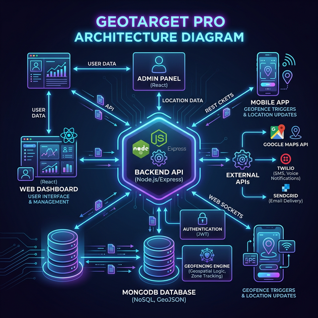
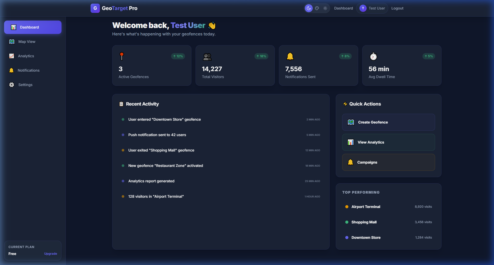
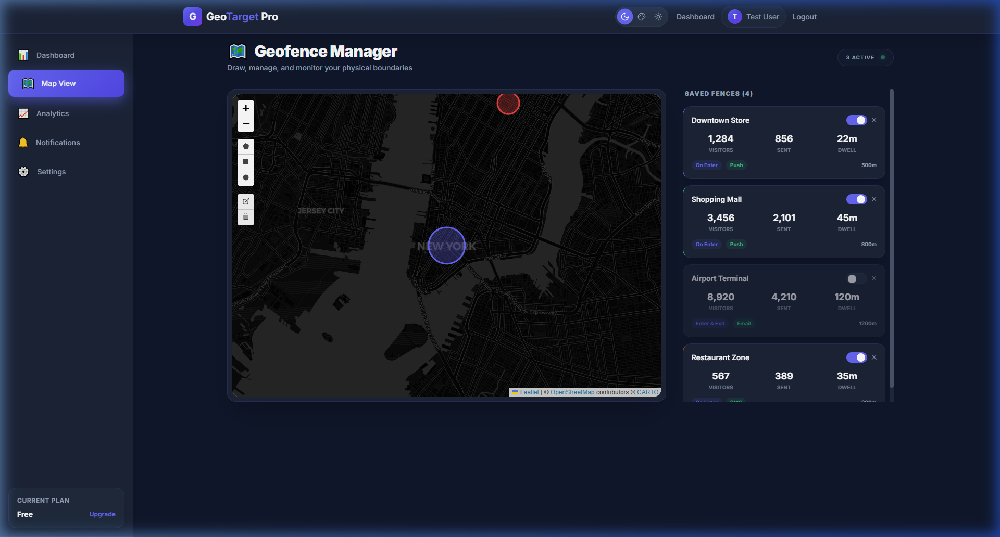
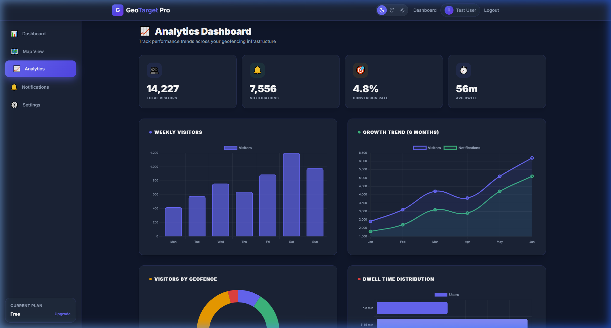

# GeoTarget Pro — Location Intelligence & Geofencing Platform

GeoTarget Pro is a high-performance geofencing platform designed for modern businesses to bridge the gap between digital marketing and physical locations. Using precise location data, businesses can trigger automated marketing campaigns, track audience analytics, and enhance customer engagement in real-time.

---

## 🚀 Business Facilities & Key Features

* **Real-time Geofencing**: Create virtual boundaries around your stores, warehouses, or event locations using Circle, Polygon, or Rectangle tools.
* **Precision Targeting**: Trigger actions (Push Notifications, SMS, Email) exactly when a customer enters or exits a predefined zone.
* **Deep Audience Analytics**: Track daily visitors, average dwell time, and conversion trends through interactive dashboards.
* **Campaign Management**: Schedule and manage multiple marketing campaigns for different locations.
* **Privacy First (GDPR/CCPA)**: Built-in consent management and data privacy controls to ensure compliance with global standards.

---

## 🛠️ Technology Stack & Tools



### Frontend

- **React 18 + Vite**: For a fast, responsive, and modern user interface.
* **Tailwind CSS**: For high-quality cyberpunk glassmorphism design.
* **Leaflet.js**: For interactive map visualization and geofence drawing.
* **Chart.js**: For data visualization and analytics.

### Backend

- **Node.js & Express**: High-performance API server.
* **MongoDB + Mongoose**: Scalable NoSQL database for flexible data modeling.
* **JWT & Bcrypt**: Secure authentication and password hashing.
* **Helmet & Rate Limiter**: Advanced security middleware.

---

## 📈 Why GeoTarget Pro for Your Business?


1. **Drives Foot Traffic**: Increase store walk-ins by sending personalized offers to customers nearby.
2. **Hyper-Local Marketing**: Target customers based on their exact physical context, leading to 3x higher engagement compared to traditional ads.
3. **Data-Driven Decisions**: Understand peak hours and customer behavior patterns to optimize staffing and marketing spend.
4. **Competitive Edge**: Target customers visiting competitor locations ("Geo-conquesting") to steal market share.

---

## 🔗 Recommended API Integrations for Maximum ROI

To make GeoTarget Pro fully ready for enterprise-scale operations, we recommend integrating the following APIs:

1. **Google Maps API**: For more precise geocoding, autocomplete, and advanced map layers.
2. **Twilio API**: For high-reliability SMS and mobile notifications.
3. **SendGrid API**: For professional email automation for exit/entry triggers.
4. **Stripe API**: For subscription-based billing and premium feature management.
5. **Firebase Cloud Messaging (FCM)**: For real-time cross-platform push notifications.

---

## 📸 App Preview

````carousel

<!-- slide -->

<!-- slide -->

````

---

### Current Status: **Work in Progress (90% Complete)**

- [x] High-fidelity UI & Design
* [x] Backend API Structure
* [x] Geofencing Drawing Tools
* [x] API & Frontend Integration (Auth & Geofences)
* [ ] Advanced Triggers (Upcoming)
* [ ] Production Deployment (Upcoming)
